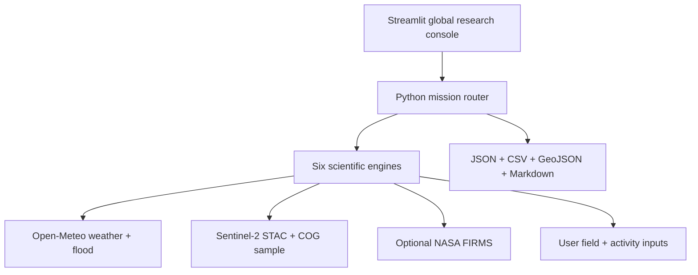

# AgriScope Earth

**A Streamlit-first, Python-powered global agriculture and environmental research console.**

AgriScope Earth brings six transparent research missions into one dark geospatial operations interface. Select any coordinate worldwide, acquire live public evidence where supported, add documented field or activity inputs, inspect the complete evidence receipt, and export a reusable research package.

> Serious screening and decision-support software, not a validated universal predictor. It does not replace field measurements, official warnings, audited inventories, causal analysis or professional agronomic advice.

## Why this release is useful

- **Guided mode** explains what to enter, what the result means, and what to verify next.
- **Research mode** exposes satellite search controls, weather overrides, coefficients, factors, and the complete machine-readable record.
- **Real global services** include Open-Meteo weather/flood/geocoding, keyless Sentinel-2 STAC/COG access, and optional NASA FIRMS.
- **Two map modes** provide a dependable non-WebGL Leaflet map and an original tactical 3D deck.gl view.
- **No silent fake data:** every fallback is labelled `demonstration` and every unavailable source is recorded.
- **Research receipts** preserve source status, item ID, acquisition/access time, sampled area, valid-pixel fraction, inputs, equations version, caveats, and analysis ID.
- **Reusable outputs** include JSON, CSV, GeoJSON, Markdown, and a temporary multi-run comparison table.

## What is included

| Mission | Research question | Main outputs |
|---|---|---|
| Flood & Crop Exposure Watch | Where could forecast river conditions expose agricultural land? | Discharge ratio, rainfall, screened exposure |
| Crop Stress Patrol | Which fields should be checked first for vegetation, moisture or heat stress? | Live or supplied NDVI/NDMI, quality fraction, source receipt, verification area |
| Wetland & Land-Use Change Audit | How have water, cropland and tree-cover shares changed? | Class change, conversion pressure, changed area |
| Irrigation Intelligence | How much water and pumping energy may be needed? | FAO-56 water balance, volume, electricity |
| Agricultural Carbon Scanner | What is the Tier 1 footprint of supplied farm activity? | Fertilizer, rice, energy and livestock CO₂e |
| Agricultural Fire & Heat Watch | Where do heat, dryness, wind and hotspots justify verification? | Heat index, rainfall, wind, optional FIRMS detections |

Every result labels evidence as `observed`, `near-real-time`, `forecast`, `modelled`, `calculated`, `user-supplied`, `demonstration` or `unavailable`. The displayed evidence-completeness percentage is a traceability heuristic—not accuracy, probability, a p-value, or a confidence interval.

## Quick start: Streamlit

Python 3.12 is recommended.

```bash
git clone https://github.com/180-abdullah/agriscope-earth.git
cd agriscope-earth
python -m venv .venv
```

Activate the environment:

```bash
# Windows PowerShell
.venv\Scripts\Activate.ps1

# macOS or Linux
source .venv/bin/activate
```

Install and run:

```bash
pip install -r requirements.txt
streamlit run streamlit_app.py
```

Open `http://localhost:8501`.

The app works without paid keys. Live Sentinel-2, weather, flood, and geocoding are keyless; a free NASA FIRMS key is optional. A first deployment can take several minutes while geospatial wheels install.

## Publish it for everyone

The fastest public deployment is Streamlit Community Cloud:

1. Push this repository to GitHub.
2. Sign in at [share.streamlit.io](https://share.streamlit.io/).
3. Create an app from the repository's `main` branch.
4. Set the main file to `streamlit_app.py`.
5. Choose public visibility and deploy.

See [DEPLOY_STREAMLIT.md](DEPLOY_STREAMLIT.md) for complete GitHub upload, secrets, Docker and publishing instructions.

## Architecture



Application logic and scientific processing are Python. Streamlit renders the interface; Folium/Leaflet provides the dependable map and PyDeck/deck.gl provides the optional 3D operations view. The repository also retains an optional React/Cesium presentation layer and FastAPI service for teams that want a split frontend/backend deployment.

## Repository map

```text
streamlit_app.py                 Main public Streamlit application
streamlit_ui/                    Guided content, maps, geocoding and exports
requirements.txt                Streamlit Cloud and local dependencies
runtime.txt                     Python runtime selection
.streamlit/config.toml          Dark tactical theme
backend/app/missions/           Six scientific mission engines
backend/app/services/           Bounded public Earth-data clients
backend/tests/                  Deterministic scientific and API tests
docs/METHODOLOGY.md             Equations, assumptions and boundaries
docs/DATA_SOURCES.md            Provider roles, status and limitations
docs/SCIENTIFIC_VALIDATION.md    Integrity audit and validation roadmap
docs/USER_GUIDE.md               Plain-language operating guide
DEPLOY_STREAMLIT.md             GitHub + public deployment guide
Dockerfile.streamlit            Container image for the Streamlit app
docker-compose.streamlit.yml    One-command container deployment
app/                            Optional React/Cesium presentation layer
```

## Optional NASA FIRMS detections

Request a free [NASA FIRMS map key](https://firms.modaps.eosdis.nasa.gov/api/map_key/), then create `.streamlit/secrets.toml`:

```toml
FIRMS_MAP_KEY = "your-key-here"
```

The secret file is ignored by Git. On Streamlit Community Cloud, add the same value under **App settings → Secrets**.

## Docker

```bash
docker compose -f docker-compose.streamlit.yml up --build
```

Open `http://localhost:8501`.

## Optional FastAPI service

The same engines are available as an API:

```bash
uvicorn backend.app.main:app --reload --port 8000
```

Open `http://localhost:8000/docs`. The main analysis endpoint is `POST /api/v1/analyze`.

Example:

```bash
curl -X POST http://localhost:8000/api/v1/analyze \
  -H "Content-Type: application/json" \
  -d '{
    "mission": "irrigation",
    "latitude": 29.9,
    "longitude": 31.2,
    "area_hectares": 100,
    "parameters": {
      "crop": "maize",
      "application_efficiency": 0.70,
      "pump_efficiency": 0.55,
      "total_dynamic_head_m": 18
    }
  }'
```

Mission IDs are `flood-watch`, `crop-stress`, `land-change`, `irrigation`, `carbon` and `fire-heat`.

## Quality checks

```bash
pip install -r requirements.txt -r backend/requirements-dev.txt
python -m compileall -q streamlit_app.py streamlit_ui backend/app
pytest backend/tests tests/test_streamlit_app.py -q
```

GitHub Actions runs the Python checks and also validates the optional presentation layer.

## Scientific use and limitations

- Read [Methodology and equations](docs/METHODOLOGY.md).
- Read [Data sources and limitations](docs/DATA_SOURCES.md).
- Read [Scientific validation and integrity status](docs/SCIENTIFIC_VALIDATION.md).
- Share the [User guide](docs/USER_GUIDE.md) with new users.
- Treat `demonstration` values as interface/test data, never as observed facts.
- Record the methodology version and access dates for reproducible work.
- Cite every upstream dataset actually used.

Open-Meteo and FIRMS availability, rate limits and terms remain controlled by their providers. For operational decisions, consult local authorities and validate results on the ground.

## License and attribution

Original AgriScope Earth code is released under the [MIT License](LICENSE). CesiumJS, deck.gl, Leaflet, OpenStreetMap, CARTO basemaps and scientific data providers retain their own terms and required attribution.

The tactical spatial-intelligence feel is inspired by the interaction language of *God's Eye View*, while all AgriScope layouts, layers, scientific workflows, copy and branding are original. No promotional media, bundled models, brand assets or source code from that project are included.

Academic users can cite the project with [CITATION.cff](CITATION.cff).
